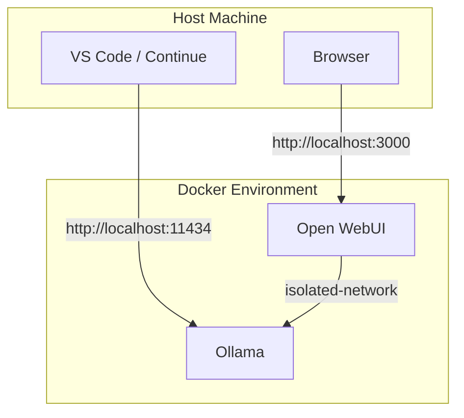

# Local LLM Stack (Ollama + Open WebUI + Continue)

This project sets up a local Large Language Model (LLM) environment using **Ollama** for the backend and **Open WebUI** for the frontend interface and Configure Continue for code assistance.

## Prerequisites
- **Docker** and **Docker Compose** installed.
- **NVIDIA Drivers** (required for the GPU configuration in `docker-compose.yml`).

## Privacy & Isolation

In this configuration:

- **Ollama** has no internet access. Even if it wanted to "leak" data, it has no exit route (gateway).
- The **Interface (Open WebUI)** acts as a bridge. It receives your commands via the browser and passes them to Ollama on the isolated network.
- Your code leaves your browser -> enters Open WebUI -> goes to Ollama. From there, it has nowhere to go.

### Architecture Diagram



## Getting Started

### 1. Start the Services
Pull images and start the containers:
```bash
docker compose up -d
```

### 2. Download a Model
In order to download this model the line `isolated-network: internal: true` should be COMMENTED, after download the model UNCOMMENT and `docker compose up -d`
To run a model (e.g., `qwen2.5-coder:3b`, recommended for VRAM < 4GB):
```bash
docker exec -it ollama ollama run qwen2.5-coder:3b
```
VRAM (Est.) 1.3 GB

```bash
docker exec -it ollama ollama run qwen2.5-coder:1.5b
```
No VRAM 

```bash
docker exec -it ollama ollama run qwen2.5-coder:0.5b
```


### 3. Access the Web Interface
Open your browser to:
http://localhost:3000/

### 4. Testing API

```bash
curl http://localhost:11434/api/tags
```
or

```bash
curl http://localhost:11434/api/generate -d '{
  "model": "qwen2.5-coder:1.5b",
  "prompt": "Write a hello world in Python",
  "stream": false
}'
```

## Install Code assitant extention

```bash
code --install-extension Continue.continue
```
Go to Continue extention local config file `%USERPROFILE%\.continue\config.yaml` and add this suggested configuration

```yaml
models:
  - name: "Ollama - Qwen 2.5 Coder 1.5B"
    provider: ollama
    model: "qwen2.5-coder:1.5b" # The this value from curl http://localhost:11434/api/tags
    apiBase: "http://localhost:11434"

  - name: "Ollama - Qwen 2.5 Coder 3Bs"
    provider: ollama
    model: "qwen2.5-coder:3b"
    apiBase: "http://localhost:11434"

tabAutocompleteModel:
  title: "Fast Autocomplete"
  provider: ollama
  model: "qwen2.5-coder:1.5b" # The this value from curl http://localhost:11434/api/tags
  apiBase: "http://localhost:11434"

# Configurações extras para performance em GPUs de entrada
completionOptions:
  temperature: 0.1
  maxTokens: 512 # Reduzir um pouco ajuda a evitar picos de VRAM

allowAnonymousTelemetry: false
```

## Troubleshooting

If you cannot connect to `localhost:3000`:
1. **Try using the IP directly:** http://127.0.0.1:3000
2. **Check if the container is running:**
   ```bash
   docker compose ps
   ```
3. **View application logs:**
   ```bash
   docker compose logs -f open-webui
   ```